## Create GUI with Python and TKinter

```
from tkinter import *
root = Tk()

my_label = Label(root, text = "Hello World!!! I Love Python!!!")
my_label.pack()

root.mainloop()
```

output


## Create GUI using Icons, Titles and Dimentions with Python & TKinter

```
from tkinter import *
root = Tk()

root.title("MY BOX GUI")
root.iconbitmap("exo.ico")

my_label = Label(root, text = "Hi").pack()
my_label2 = Label(root, text = "How are you today").pack()

root.mainloop()
```

output

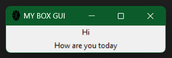

untuk ubah ukuran window -> ("[width]x[height]")
```
from tkinter import *
root = Tk()

root.title("MY BOX GUI")
root.iconbitmap("exo.ico")
root.geometry("300x150")

my_label = Label(root, text = "Hi").pack()
my_label2 = Label(root, text = "How are you today").pack()

root.mainloop()
```

output

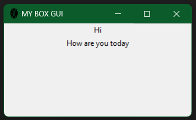

## Positioning with TKinter Grid System in Python

```
from tkinter import *
root = Tk()

root.title("MY BOX GUI")
root.geometry("300x150")

my_label = Label(root, text = "My new GUI app").grid(row=0, column=3)
my_label2 = Label(root, text = "This is line 2").grid(row=2, column=0)

root.mainloop()
```

output: yang dipake row 0 sama row 2, karena ga pake row 1 jadi dianggap gaada

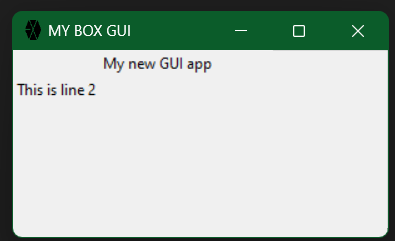

kalau ada pake row 1, walaupun gaada kayak isinya kayak code ini:
```
from tkinter import *
root = Tk()

root.title("MY BOX GUI")
root.geometry("300x150")

my_label = Label(root, text = "My new GUI app").grid(row=0, column=3)
my_label1 = Label().grid(row=1, column=3)
my_label2 = Label(root, text = "This is line 2").grid(row=2, column=0)

root.mainloop()
```

output nya jadi gini

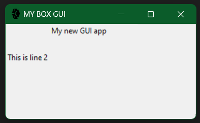

## Create GUI Buttons in TKinter with Python 

```
from tkinter import *
root = Tk()

root.title("MY BUTTON")
root.geometry("300x250")

def my_click():
    my_label = Label(root, text = "WELCOME TO THE COURSE!!!", fg="#3371FF")
    my_label.pack()

my_button = Button(root, text = "HEY CLICK THIS!!!", command=my_click, fg="white", bg="black", padx=30, pady=30)
my_button.pack()

root.mainloop()
```
- bikin fungsi buat apa yang bakal dilakuin tombol itu kalau di-klik
- ngasih warna foreground sama background
- padx sama pady itu buat ukuran button nya

output: bakal tampilin label tiap button ditekan

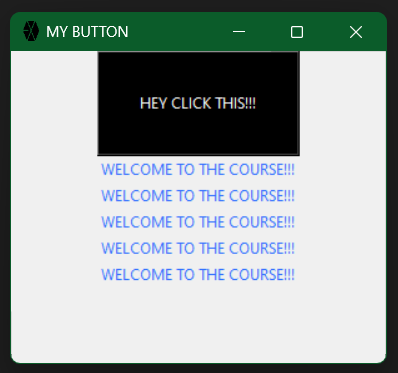

## Input Boxes or Input Fields with TKinter and Python

```
from tkinter import *
root = Tk()

root.title("MY BUTTON")
root.geometry("400x250")

e = Entry(root, width=30, fg="red")
e.grid(row=0, column=1)

ee = Entry(root, width=30, fg="black")
ee.grid(row=0, column=2)

def clickme():
    mylabel = Label(root, text="Hello " + e.get())
    mylabel.grid(row=3, column=1)
    e.delete(0, END)

def clickme2():
    mylabel = Label(root, text="Hello " + ee.get())
    mylabel.grid(row=3, column=2)
    ee.delete(0, END)

mybutton = Button(root, text="Enter your FIRST NAME", padx=10, pady=10, bg="white", fg="green", command=clickme).grid(row=2, column=1)
mybutton = Button(root, text="Enter your LAST NAME", padx=10, pady=10, bg="white", fg="green", command=clickme2).grid(row=2, column=2)

root.mainloop()
```
- .delete(0, END) itu buat hapus value nya biar ga numpuk kayak image sebelumnya

output

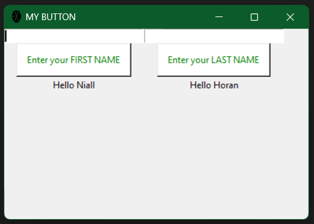

## Creating Radio Buttons with TKinter 
```
from tkinter import *
root = Tk()

root.title("MY MENU APP")
root.geometry("500x500")

q = IntVar()
q.get()
q.set(2)

def clickme(value):
    my_label = Label(root, text=value)
    my_label.pack()

Radiobutton(root, text = "Option 1", variable= q, value = 1).pack(anchor="w")
Radiobutton(root, text = "Option 2", variable= q, value = 2).pack(anchor="w")
Radiobutton(root, text = "Option 3", variable= q, value = 3).pack(anchor="w")
Radiobutton(root, text = "Option 4", variable= q, value = 4).pack(anchor="w")

my_label = Label(root, text=q.get())
my_label.pack()

my_button = Button(root, text="SUBMIT!", command=lambda :clickme(q.get()))
my_button.pack()

root.mainloop()
```
- IntVar itu kelas yang khusus dipake buat nyimpen nilai integer dan secara otomatis melacak perubahan yang terjadi pada RadioButton
- q.set(2) berarti RadioButton yang value nya 2 bakal terpilih secara default saat app pertama kali dijalankan
- anchor("w") itu biar RadioButton nya rata kiri, ngikutin mata angin "West". kalau anchor("e") nanti jadi rata kanan

output:

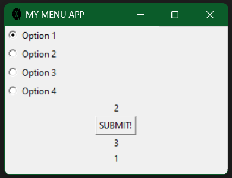

## Creating Menu with Radio Buttons in TKinter and Python
bedanya sama yang sebelumnya:
- bikin RadioButton nya pake perulangan, nggak manual kek yang tadi
```
from tkinter import *
root = Tk()

root.title("MY MENU APP")
root.geometry("300x300")

PRODUCT = [
    ("Microsoft Surface", "Microsoft Surface"),
    ("ASUS Zenfone", "ASUS Zenfone"),
    ("Google Pixel", "Google Pixel"),
    ("Hp OMEN", "Hp OMEN"),
    ("Apple iPhone SE2", "Apple iPhone SE2"),
    ("BOSE q3 Headphones", "BOSE q3 Headphones")
]

choice = StringVar()
choice.set("Microsoft Surface")

for text, mode in PRODUCT:
    Radiobutton(root, text=text, variable=choice, value=mode).pack(anchor="w")

def clicked(value):
    my_label = Label(root, text=value)
    my_label.pack()

my_button = Button(root, text="BUY NOW!", command=lambda : clicked(choice.get()))
my_button.pack()

root.mainloop()
```

outputnya mirip kek yang tadi

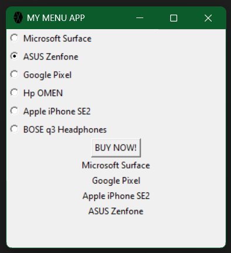

## Creating Drop Down Menu Options in TKinter and Python

```
from tkinter import *
root = Tk()

root.title("MY MENU APP")
root.geometry("300x300")

def open():
    my_label = Label(root, text=clicked.get())
    my_label.grid(row=2, column=2, padx=10, pady=10, ipadx=30)

options = [
    "iPhone XR",
    "iPhone SE",
    "iPhone X",
    "iPhone X MAX",
    "Google Pixel"
]

clicked = StringVar()
clicked.set(options[0])

drop = OptionMenu(root, clicked, *options)
drop.grid(row=0, column=1, padx=10, pady=10)

my_button = Button(root, text="SUBMIT", command=open)
my_button.grid(row=0, column=2, padx=10, pady=10)

root.mainloop()
```
- variabel drop -> root (parent window), clicked (yang dipilih user dari menu), *options (semua value yang ada di variabel options)
- clicked.set(options[0]) -> default yang ditampilkan itu value pertama dari variabel options
- ipadx itu ruang kosong tambahan di dalam widget, di sisi horizontal (kiri dan kanan)
- kalau padx itu di luar widget yang nambahin jarak antara widget ini dengan widget lain

output nya ini nampilin label kalau udah klik submit dan ga bakal numpuk, jadi cuma bakal tampilin satu aja tapi ganti-ganti tergantung option yang dipilih

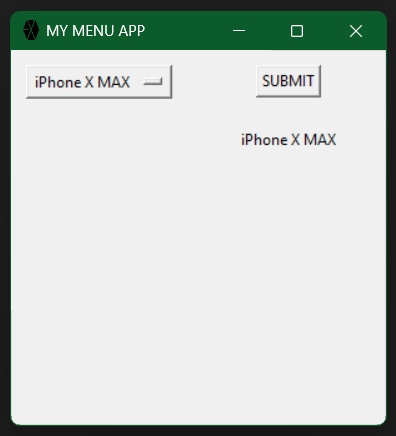

## Using Frames and Exit Buttons in TKinter and Python

```
from tkinter import *
root = Tk()

root.title("MY MENU APP")
root.geometry("350x300")

frame = LabelFrame(root, text="This is a frame!", padx=100, pady=100)
frame.grid(padx=20, pady=20)

def my_click():
    label1 = Label(frame, text="Hello User!", fg="blue")
    label1.grid(row=10, column=10)

b1 = Button(frame, text="CLICK ME!", command=my_click)
b1.grid(row=0, column=1)

c = Button(frame, text="EXIT", command=root.quit)
c.grid(row=0, column=3)

root.mainloop()
```
- jadi, biar di dalem frame, root-nya diganti jadi variabel frame
- root.quit itu buat tutup file atau exit

output

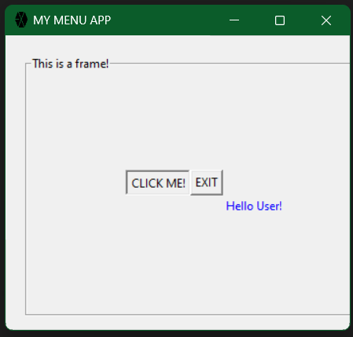

## Creating Horizontal and Vertical Sliders in TKinter and Python

```
from tkinter import *
root = Tk()

root.title("Slider Application")
root.geometry("250x300")

vertical_slider = Scale(root, from_ = 0, to = 250, orient=VERTICAL)
vertical_slider.pack(anchor='w')

horizontal_slider = Scale(root, from_ = 0, to = 300, orient=HORIZONTAL)
horizontal_slider.pack(anchor="w")

def slider():
    vertical_label = Label(root, text=vertical_slider.get()).pack()
    horizontal_label = Label(root, text=horizontal_slider.get()).pack()

ver_button = Button(root, text="CLICK FOR VALUES!", command=slider)
ver_button.pack()

root.mainloop()
```

output

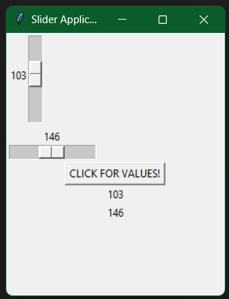

## DJ Console using Vertical Sliders in TKinter and Python

```
from tkinter import *
root = Tk()

root.title("Slider Application")
root.geometry("550x200")

vertical_slider1 = Scale(root, from_ = 0, to = 300, orient=VERTICAL)
vertical_slider1.grid(row=0, column=0)

vertical_slider2 = Scale(root, from_ = 0, to = 300, orient=VERTICAL)
vertical_slider2.grid(row=0, column=1)

vertical_slider3 = Scale(root, from_ = 0, to = 300, orient=VERTICAL)
vertical_slider3.grid(row=0, column=2)

vertical_slider4 = Scale(root, from_ = 0, to = 300, orient=VERTICAL)
vertical_slider4.grid(row=0, column=3)

vertical_slider5 = Scale(root, from_ = 0, to = 300, orient=VERTICAL)
vertical_slider5.grid(row=0, column=4)

def value():
    ver_label = Label(root, text=vertical_slider1.get())
    ver_label.grid(row=0, column=5)

    ver_label = Label(root, text=vertical_slider2.get())
    ver_label.grid(row=0, column=6)

    ver_label = Label(root, text=vertical_slider3.get())
    ver_label.grid(row=0, column=7)

    ver_label = Label(root, text=vertical_slider4.get())
    ver_label.grid(row=0, column=8)

    ver_label = Label(root, text=vertical_slider5.get())
    ver_label.grid(row=0, column=9)

ver_button = Button(root, text="CLICK FOR VALUE", command=value)
ver_button.grid(row=2, column=10)

root.mainloop()
```

output

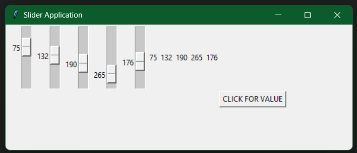

## Check Box Widget in TKinter and Python

```
from tkinter import *
root = Tk()

root.title("Slider Application")
root.geometry("200x300")

a = StringVar()

c = Checkbutton(root, text="Python", variable=a, onvalue="OK", offvalue="NO")
c.deselect()
c.pack()

def click():
    my_label = Label(root, text=a.get())
    my_label.pack()

b1 = Button(root, text="Show Value", command=click)
b1.pack()

root.mainloop()
```

output, menampilkan label sesuai value on dan off

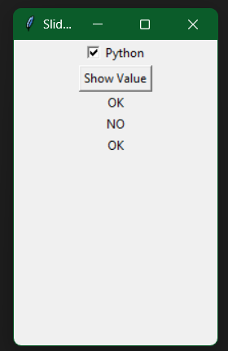

## New Window in TKinter and Python

```
from tkinter import *
root = Tk()

root.title("OLD WINDOW")
root.geometry("400x100")

def open():
    new = Toplevel()
    new.title("NEW WINDOW")
    new.geometry("300x100")
    
    label = Label(new, text="Hello, this is new window!")
    label.pack()

    B2 = Button(new, text="EXIT", command=new.quit)
    B2.pack()

L1 = Label(root, text="I am OLD WINDOW!")
L1.pack()

B1 = Button(root, text="Click this for NEW WINDOW!", command=open)
B1.pack()

mainloop()
```
- Toplevel itu jadi bisa bikin windows lebih dari satu dalam satu app tanpa harus bikin Tk() lagi di mana biasanya Tk() cuma bisa satu per app nya

output, kalau tombol EXIT di-klik, bakal nutup dua-duanya

